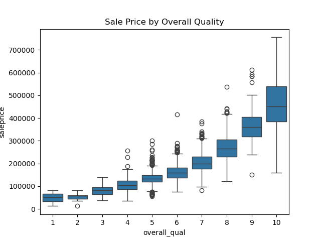
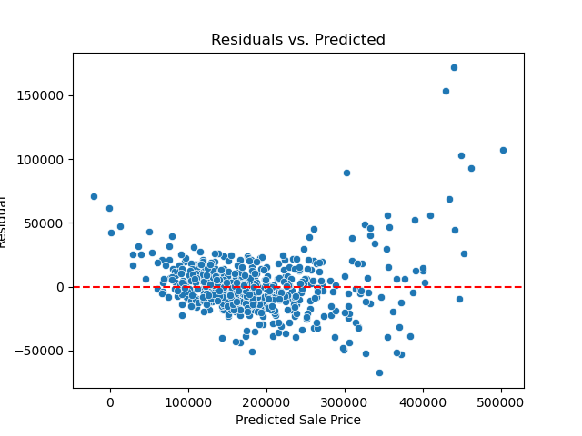

# 🏡 Ames Housing Data Project

## Problem Statement
- The Ames Housing dataset contains the records of residential property sales in Ames, Iowa, from 2006-2010. The purpose of this project is to :
- Analyze how various features of a home can influence the price.
- Build a regression model to accurately predict home prices based on those features.
- Evaluate the models performance using standard metrics and residual diagnosis.
- provide insights that can be used by real estate investors and buyers. 

## Data Dictionary

### Data Cleaning Steps

- **Standardized Column Names**: All column names were converted to lowercase and underscores for consistency.

- **Lot Frontage**:  
  Missing values in the `lot_frontage` column were imputed using the **median frontage per neighborhood**. This approach preserves **neighborhood-specific patterns** in lot size.

- **Alley Access**:  
  Missing values in the `alley` column were assumed to indicate **no alley access**. These were imputed with the category **'No Alley'** to retain that information.

- **Masonry Veneer**:  
  Missing values in `mas_vnr_type` were investigated alongside `mas_vnr_area`. Nearly all missing types occurred when the area was 0, indicating **no veneer**.  
  - Imputed with category **'None'**  
  - One-Hot Encoding (OHE) was applied to convert the masonry type into binary columns.

- **Basement Data**:
  - Rows missing basement square footage also had missing basement type info.
  - Homes without basements generally had square footage recorded as **0.0**, which was consistent.
  - Only **one row (Index 1341)** was missing both numerical and categorical basement data — a likely data entry issue, handled via imputation.
  - `bsmt_full_bath` and `bsmt_half_bath` were each missing **two values**; imputed with **0.0** to indicate no basement bathrooms.

- **Electrical**:  
  Only one missing value in `electrical`, which was imputed using the **most frequent system**.

- **Fireplace Quality**:  
  All missing `fireplace_qu` values occurred when `fireplaces` was 0 — confirming **no fireplace to rate**. Imputed with **'None'**.

- **Garage**:  
  - Missing values in garage-related categorical columns (`garage_type`, `garage_finish`, `garage_qual`, `garage_cond`) were aligned with missing or 0 values in `garage_cars` and `garage_area`, confirming **no garage present**.  
  - Imputed with **'None'**
  - Applied **One-Hot Encoding (OHE)** to convert categorical garage data into binary indicators.

- **Pool, Fence, and Misc Features**:
  - Missing `pool_qc` values only occurred when `pool_area` was 0 → imputed with **'None'**
  - Missing values in `fence` and `misc_feature` were treated as the **absence** of those features and imputed with **'None'**

#### Visualization 1:
- A box plot of the sale price, and overall quality was used to visualize the distribution of home prices across different quality ratings.

- Each box represents the spread of sale prices at that quality level.

- There is a clear positive relationship between quality and sale price. Higher quality homes typically sell for more.

#### Visualization 2: 
- This plot shows the residuals (prediction errors) of our linear regression model against the predicted sale prices.
  
- A well behaved residual plot should show no clear patterns and have residuals centered around zero.

- The residuals appear randomly scattered, indicating the model captures the relationships between the features and sale price well.

- No strong curvatures are present, supporting the assumptions of **linearity** and **constant variance**.

- A few large residuals appear at high predicted prices, which is expected in real estate due to variability in high end homes. 

## Model Performance

> R2
- The model acheived an R2 score of 0.93 on the test set, indicating strong predictive performance.

- Approximately 93% of the variability in home sale prices can be explained by the features included in the model. This suggests that the model is capturing the key drivers of price with a high degree of accuracy.

> RMSE
- The model achieved a train RMSE of 19,723.3 and a test RMSE of 21,497.4, indicating consistent performance and no signs of overfitting.

- On average, the model's predictions are within $20,000 of the actual sale price, a strong result given the range of home prices in the dataset.

- For comparison, the baseline model — which simply predicts the mean of the target variable — produced a test RMSE of 84,319.7.

- This highlights the value added by the model, which is significantly more accurate than a naive mean-based approach.

> Coefficient Analysis

- Upon reviewing the coefficients, we found that many of the largest values were tied to rare one-hot encoded categories, such as specific pool quality levels or unusual garage types.

- These features appeared in very few homes, and their high coefficients likely reflect overfitting to small patterns in the data, rather than true predictive power.

- We chose to focus interpretation on more stable, high-frequency features such as 'overall_qual' (overall quality), and 'gr_liv_area' (above-ground living area)which had a positive and consistent impact on sale price.

- Although features like functional_Typ, street_Pave, and kitchen_qual_Ex had relatively large coefficients and high support, we prioritized gr_liv_area and overall_qual for interpretation because they are:

        - Continuously scaled and not the result of binary one-hot encoding

        - Present in every home, making them robust and generalizable

        -Strongly aligned with domain knowledge: home size and overall quality are universally tied to home value

  
- **HOLDING ALL ELSE CONSTANT**, the model estimates that for every 1 point increase in overall quality (a 1-10 rating of overall home quality) the sale price increases by approximately $6902.

- **HOLDING ALL ELSE CONSTANT**, the model estimates that for every additional square foot of above-ground living area, the sale price increases by approximately $66.44.

> Residual Diagnosis

- The majority of residuals are centered around 0 Slight funneling (wider spread) at higher predicted values (above $300K) This could suggest mild heteroscedasticity: the model’s errors increase as home prices rise.

- The residuals are randomly distributed around zero, indicating that the model satisfies the assumptions of linearity and independence. While there is some increased variance in residuals at higher predicted sale prices, this is a common pattern in housing models due to the wider range and variability of luxury properties. Overall, the residual distribution supports that the model generalizes well.

### Model Selection
- We selected a linear regression model for this project because the target variable- home sale price- is continuous and numerical.

- Linear regression a interpretable modeling technique that is well suited for predicting numeric outcomes and understanding the relationship between features and price.

- The goal of this project was not only accurate prediction, but also interpreting feature influence, which linear regression handles transparently through its learned coefficients. 

## Conclusions/Recommendations

- Unsurprisingly, the strongest predictors of home value were overall_qual (build quality) and gr_liv_area (living space), confirming that size and quality remain the most influential factors in home pricing.

- The model also highlighted homes with good basement lighting (bsmt_exposure_Gd), premium kitchen quality (kitchen_qual_Ex), and a typical layout (functional_Typ) consistently sold for significantly more - often adding 14-21K to the sale price. 

## Limitations

- Renovation history was not included in the dataset. While features like year_remod/add offer a hint, they don’t capture the extent or quality of renovations, which can have a significant impact on sale price.

- No data on location convenience was available — such as proximity to public transportation, schools, grocery stores, or shopping centers. These are known to influence buyer preferences and property values.

- Property tax information was not included, even though tax rates and brackets can shape affordability and impact market dynamics across neighborhoods.
